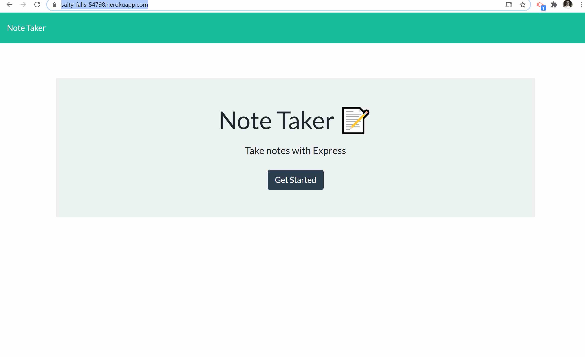
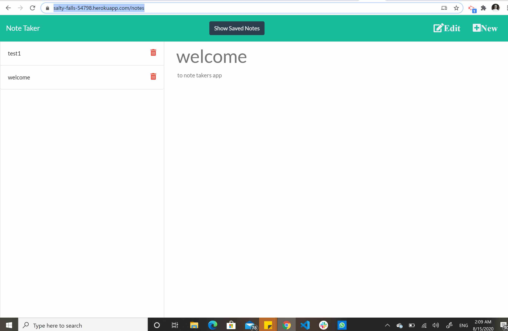
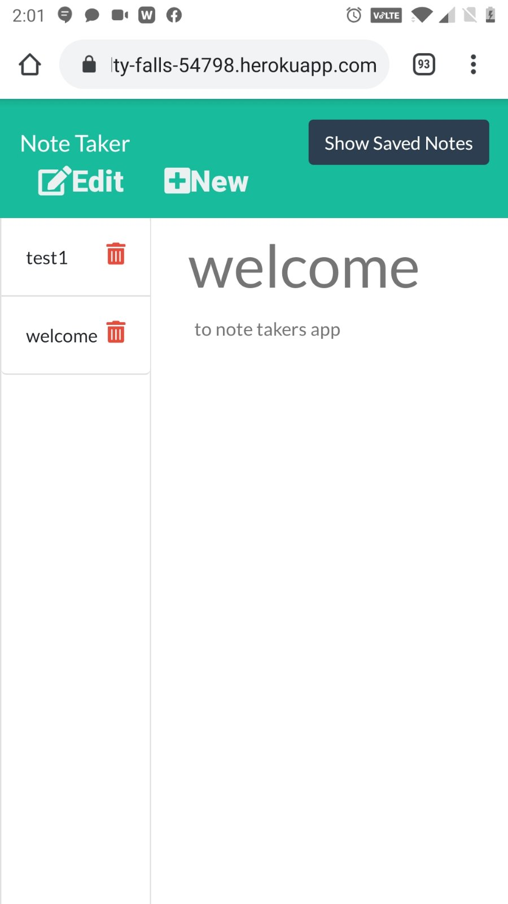

# Note Taker App 
## Description 
Note taker App is an application that can be used to write, save, edit and delete notes. This application will use an express back-end and save and retrieve note data from a JSON file.
## Table of Contents
* [Installation](#installation)
* [Usage](#usage)
* [Tests](#tests)
* [License](#license)
* [Questions](#questions)
* [Review](#review)
## Installation 
You can clone or fork the repo. Or just visit the deployed site:  https://salty-falls-54798.herokuapp.com/notes.
## Usage 
Visit the deployed site. Notes are available for all to see, so please keep it civil.

front page
 

Note editing page on desktop:
 

Note editing page on cell phone
 


## Contributing 
 None 
## License 
 Licensed under MIT License. 
## Tests 
All server calls are tested with Mocha/Chai framework. You can run them by:

```
npm test
```

All tests are in `test` folder
## Questions 
 You can see more of my Projects on my [GitHub profile](https://github.com/sbolotnikov) 

 Contact [sbolotnikov](mailto:sbolotnikov@gmail.com) 
## Review 
  * Here is this repo link: https://github.com/sbolotnikov/Note-Taker
 
  * Link: [Note Taker App](https://note-taker-xgt8.onrender.com/)
